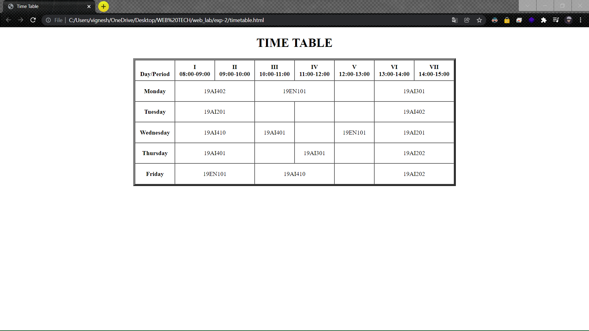

# Time-table

## AIM
To Write a html webpage using table tags and create a time table

# ALGORITHM
### STEP 1
create a simple html page using heading tag
### STEP 2
Add a table tag to the program
### STEP 3
Add table tags and attributes
### STEP 4
Execute the program

# CODE
~~~
<!DOCTYPE html>
<html lang="en">
<head>
    <meta charset="UTF-8">
    <meta http-equiv="X-UA-Compatible" content="IE=edge">
    <meta name="viewport" content="width=device-width, initial-scale=1.0">
    <title>Time Table</title>
</head>
<body>
	<h1 align="center">TIME TABLE</h1>
	<table border="5" cellspacing="0" align="center">
		<tr>
			<td align="center" height="50"
				width="100"> 
				<b>Day/Period</b> 
			</td>
			<td align="center" height="50"
				width="100">
				<b>I 08:00-09:00</b>
			</td>
			<td align="center" height="50"
				width="100">
				<b>II 09:00-10:00</b>
			</td>
			<td align="center" height="50"
				width="100">
				<b>III 10:00-11:00</b>
			</td>
			<td align="center" height="50"
				width="100">
				<b>IV 11:00-12:00</b>
			</td>
			<td align="center" height="50"
				width="100">
				<b>V 12:00-13:00</b>
			</td>
			<td align="center" height="50"
				width="100">
				<b>VI 13:00-14:00</b>
			</td>
			<td align="center" height="50"
				width="100">
				<b>VII 14:00-15:00</b>
			</td>
		</tr>
		<tr>
			<td align="center" height="50">
				<b>Monday</b></td>
			<td colspan="2" align="center" height="50">19AI402</td>
			<td colspan="2" align="center" height="50">19EN101</td>
			<td align="center" height="50"></td>
			
			<td colspan="2" align="center"
				height="50">19AI301</td>
		</tr>
		<tr>
			<td align="center" height="50">
				<b>Tuesday</b>
			</td>
			<td colspan="2" align="center" height="50">19AI201</td>
            <td align="center" height="50"></td>
            <td align="center" height="50"></td>
            <td align="center" height="50"></td>
			<td colspan="2" align="center" height="50">19AI402</td>
		</tr>
		<tr>
			<td align="center" height="50">
				<b>Wednesday</b>
			</td>
			<td colspan="2" align="center" height="50">19AI410</td>
            <td align="center" height="50">19AI401</td>
            <td align="center" height="50"></td>
            <td align="center" height="50">19EN101</td>
			<td colspan="2" align="center" height="50">19AI201</td>
		</tr>
		<tr>
			<td align="center" height="50">
				<b>Thursday</b>
			</td>
			<td colspan="2" align="center" height="50">19AI401</td>
            <td align="center" height="50"></td>
            <td align="center" height="50">19AI301</td>
            <td align="center" height="50"></td>
			<td colspan="2" align="center" height="50">19AI202</td>
		</tr>
		<tr>
			<td align="center" height="50">
				<b>Friday</b>
			</td>
			<td colspan="2" align="center" height="50">19EN101</td>
            <td colspan="2" align="center" height="50">19AI410</td>
            <td align="center" height="50"></td>
			<td colspan="2" align="center" height="50">19AI202</td>
		</tr>
	</table>
</body>
</html>
~~~
# OUPUT

# RESULT
webpage using table tags, time table was successfully executed.
